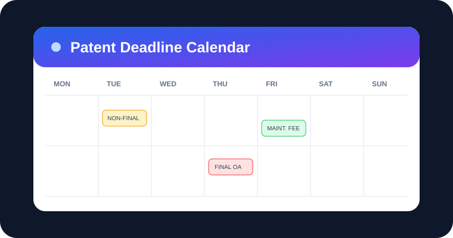
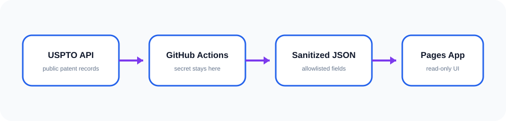

# Patent Deadline Calendar

[](https://github.com/CLTbrad/patent-deadline-calendar-showcase/actions/workflows/deploy.yml)
[](https://github.com/CLTbrad/patent-deadline-calendar-showcase/actions/workflows/sync-uspto.yml)

A forkable, read-only patent deadline calendar that turns public USPTO Patent Center data into calendar, card, and list views. API credentials stay in GitHub Actions secrets and are never shipped to the browser.



## What it includes

- Month and week calendar views
- Deadline cards and chronological list view
- Prosecution and maintenance-fee filters
- Estimated-deadline visibility control
- Search by application, patent, title, or inventor
- Daily USPTO refresh through GitHub Actions
- Static GitHub Pages hosting with no server required
- Public-data-only output; internal notes and private fields are not supported

## How it works



1. A scheduled or manually triggered workflow reads your portfolio configuration.
2. A Node script calls the USPTO Open Data Portal using a repository secret.
3. The script normalizes public records and calculates calendar dates.
4. Sanitized JSON is committed to public/data/deadlines.json.
5. GitHub Pages builds and publishes the React interface.

## Quick start

### 1. Fork and install

Fork this repository, then optionally run it locally:

```bash
npm install
npm run dev
```

The included data file displays neutral demonstration records until your first successful sync.

### 2. Configure your portfolio

Copy config/portfolio.example.json to config/portfolio.json. Set a neutral display name and choose one or both lookup methods:

```json
{
  "organization_name": "Example Research Organization",
  "applications": ["17123456", "18123456"],
  "search_query": "",
  "maximum_results": 500
}
```

- `applications`: USPTO application serial numbers; punctuation is optional.
- `search_query`: optional USPTO Open Data Portal query syntax for broader discovery.
- `maximum_results`: safety cap from 1 to 2000.

Explicit application numbers are the most predictable option. Review broad-query results before relying on them.

### 3. Add the USPTO key

Request an API key through the USPTO Open Data Portal. In the fork, open **Settings → Secrets and variables → Actions**, create a repository secret named `USPTO_API_KEY`, and paste the key there.

Never put the key in source files, portfolio.json, browser environment variables, screenshots, issues, or commits.

### 4. Run the first sync

Open **Actions → Sync USPTO Data → Run workflow**. The workflow validates configuration, retrieves public records, writes the sanitized snapshot, and commits it only when data changed.

You can also sync locally:

```bash
USPTO_API_KEY=your_key npm run sync
```

### 5. Enable GitHub Pages

Open **Settings → Pages** and select **GitHub Actions** as the source. Run **Deploy GitHub Pages** if it has not already run. The Vite base path is derived automatically from the repository name, so renamed forks work without code changes.

## Configuration and calculation rules

The sync recognizes public prosecution events containing non-final rejection, final rejection, restriction requirement, or Ex parte Quayle language. It estimates:

- Standard response date: three calendar months after the event
- Maximum extension date: six calendar months after the event
- Maintenance-fee dates: 3.5, 7.5, and 11.5 years after grant

These dates are planning aids, not legal advice. USPTO event wording, weekends, holidays, extensions, entity status, petitions, and case-specific rules can change the legally controlling date. Independently verify every deadline.

## Data contract

The UI reads `public/data/deadlines.json`. Each event may include: `id`, `type`, `due_date`, `application_number`, `patent_number`, `title`, `inventor_list`, `source_event`, `filing_date`, `grace_end`, `stage`, and `is_estimated`.

The generator allowlists those public fields. It does not ingest client names, dockets, notes, comments, credentials, correspondence addresses, or private documents.

## Troubleshooting

- **Missing secret:** confirm the name is exactly `USPTO_API_KEY`.
- **No records:** verify application numbers, query syntax, and API access in the workflow log.
- **Pages shows an old snapshot:** confirm the sync committed a changed JSON file and the deploy workflow completed.
- **Fork deploys at the wrong path:** rerun the deploy workflow; it calculates the repository path during each build.
- **Rate limit or temporary USPTO failure:** the sync retries retryable responses with exponential backoff.

## Development commands

- `npm run dev` — local Vite server
- `npm run build` — production build
- `npm run sync` — retrieve and generate the public snapshot
- `npm run check` — validate the generated snapshot and production build

## Security

The website is static. The API key exists only during the GitHub Actions job. Treat generated JSON as public because everything under `public/` is published. Branch protection is recommended for shared repositories.

## License

MIT. See [LICENSE](LICENSE).
